# Práctica 5. Copilot en Power BI

## Objetivo de la práctica:
Al finalizar la práctica, serás capaz de:
- Usar Copilot en Power BI durante el desarrollo de informes.
- Interactuar con los datos mediante lenguaje natural en Copilot Chat.

## Duración aproximada:
- 60 minutos.

---

## Instrucciones 

**Descripción:** Utilizar el reporte creado en el capítulo 2 para aplicar los conceptos revisados en este capítulo de Copilot en Power BI.

>***Nota:** Para completar este ejercicio, use el archivo que se encuentra en el repositorio de datos del curso “Practica 2” de formato .pbix.*

---

### Tarea 1. Habilitar Copilot en Power BI Desktop y Crear área de trabajo en Power BI Service

1. Abrir el archivo **Practica 2.pbix** y guardarlo como **Practica 5. Copilot en Power BI**.

2. Verificar que en Power BI Desktop estén visibles. Ir al pestaña de Inicio y comprobar que se muestren:
    - **Copilot**
    - **Preparación de datos para IA**
        
        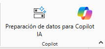

3. Si no aparecen, habilitar características de versión preliminar:
    - Ir a **Archivo → Opciones y configuración → Opciones**
    - Seleccionar **Características de versión preliminar**
    - Activar:  
        - *Preparación de datos para IA*
    - Reiniciar Power BI.

4. En Power BI Service, crear una nueva área de trabajo con capacidad Fabric (Capacidad del tejido) y selecionar la capacidad habilitada.

    > ***Nota:** Ingresar a app.powerbi.com, ir a **Áreas de trabajo > Crear área de trabajo**. Asignar un nombre y en **Configuración avanzada**, seleccionar la capacidad Fabric disponible.*

    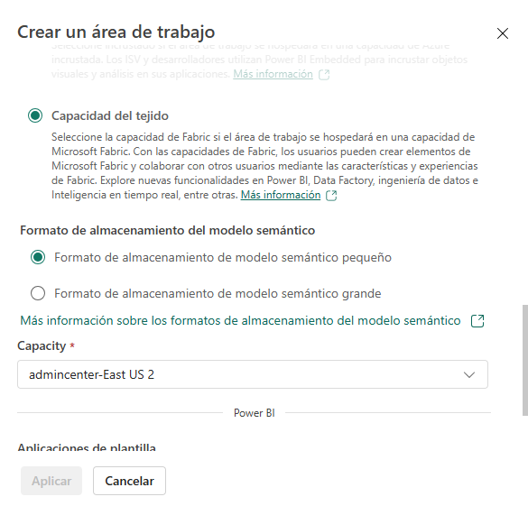

---

### Tarea 2. Interactuar con datos usando Copilot Chat
1. Abrir el panel de **Copilot Chat** desde Power BI Desktop.
2. Conectarse a un área de trabajo que admite Copilot (requiere licencia con capacidad Fabric).

    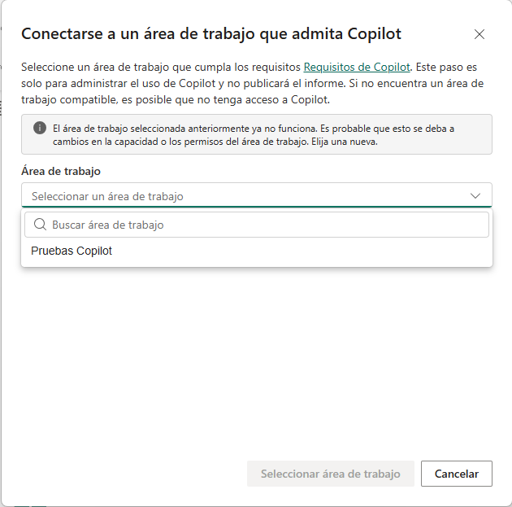

3. Ingresar el siguiente mensaje en Copilot Chat:
    > “¿Cuáles son las tendencias de ventas por región y categoría en el último año? Proporciona un resumen y sugiere visualizaciones adecuadas.”

    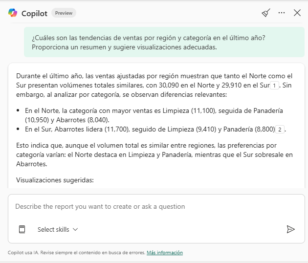

> **Importante:** Las respuestas generadas por Copilot pueden variar dependiendo de los datos disponibles, la configuración del modelo y el contexto proporcionado. Asegúrate de revisar y validar los resultados antes de utilizarlos en tu análisis o informes.

4. Dar clic en el botón borrar chat para limpiar la conversación y prepararse para la siguiente tarea.

5. En el panel de **Copilot Chat**, ingresa el siguiente mensaje para generar visualizaciones  automáticas:

    > “Crear una nueva página de informe que analice las ventas por región y seguimiento del rendimiento de los productos”

    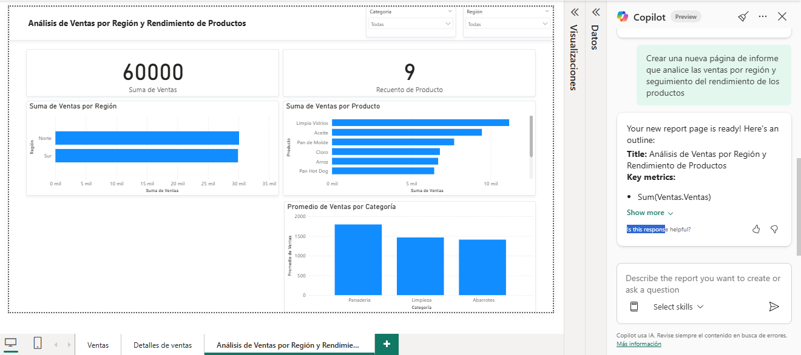

6. Revisa las visualizaciones sugeridas por Copilot que se ajusten a tus necesidades.

7. Organiza las visualizaciones en la página para que sean claras y fáciles de interpretar. Asegúrate de incluir títulos descriptivos para cada visualización:

- **Tarjeta:** "Suma de Ventas"

    - Titulo: "Total de Ventas" - Centrado.
    - Formato: Moneda, sin decimales

- **Gráfica de barras:** "Suma de Ventas por Región"
    - Titulo: "Ventas por Región"
    - Eje X: Región
    - Eje Y: Ventas

- **Gráfica de barras:** "Suma de Ventas por Producto"
    - Titulo: "Ventas por Producto"
    - Eje X: Producto
    - Eje Y: Ventas
- **Gráfica de barras:** "Promedio de Ventas por Categoría"
    - Titulo: "Ventas Promedio por Categoría"
    - Eje X: Categoría
    - Eje Y: Ventas Promedio
- **Tarjeta:** "Recuento de Productos"
    - Titulo: "Cantidad de Productos" - Centrado.
    - Formato: Número entero

    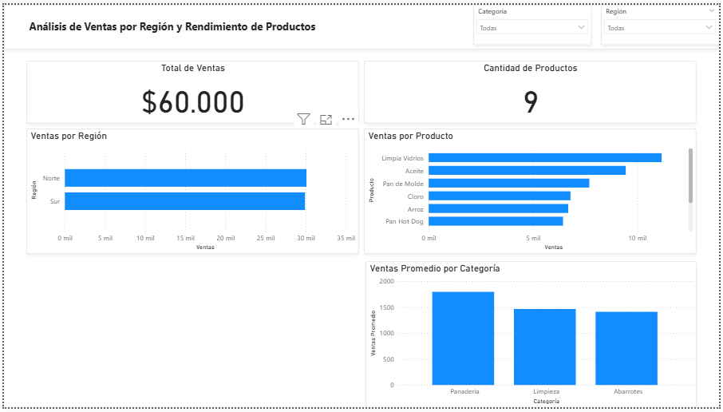

8. Personaliza los colores y formatos de las visualizaciones según las preferencias del informe o los estándares de tu organización.

---

### Tarea 3. Ceear una narrativa con Copilot

1. En el panel de visualizaciones seleccionar el objeto visual de **Narrativa**.

2. Seleccionar la opción **"Copilot"**.

    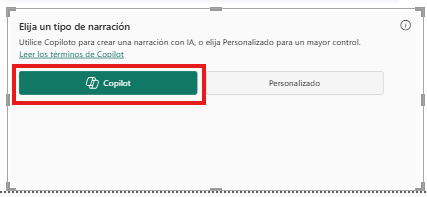

3. Ingresar el siguiente mensaje en Copilot para generar la narrativa:
    > “Genera un análisis narrativo de las ventas por región y categoría en el último año".

    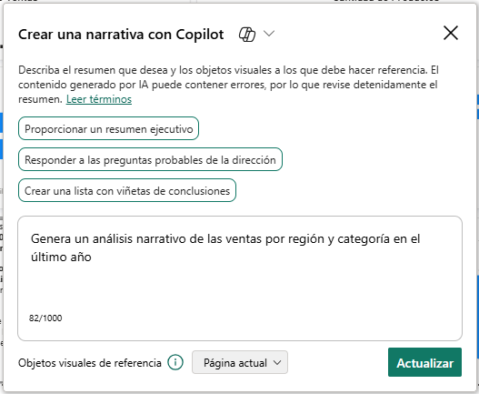

4. Revisar y ajustar la narrativa generada para asegurar que sea clara y relevante para el informe.

    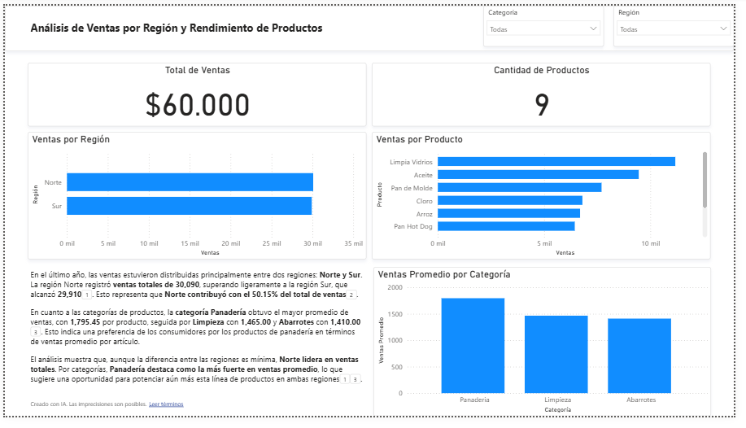

---

### Tarea 4. Preparar datos para su uso con inteligencia artificial

Se prepararán respuestas verificadas para que Copilot pueda utilizarlas eficazmente.

1. Dar clic derecho sobre el objeto visual "Ventas por Región" y seleccionar **Configurar una respuesta comprobada**.

    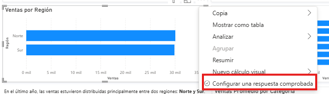

2. Agregar frases o preguntas que los usuarios puedan usar al preguntar acerca de los datos del modelo y Copilot responderá con este objeto visual.
- Ejemplos:
  - "¿Cuáles son las ventas por región?"
  - "Muéstrame las ventas totales en cada región."
  - "¿Cómo se comparan las ventas entre las diferentes regiones?"

    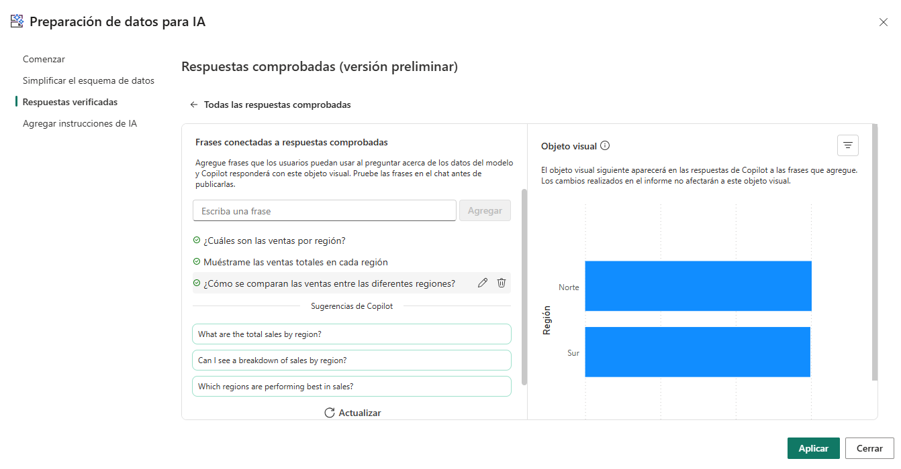

3. Dar clic en **Aplicar** para guardar la configuración y luego en **Cerrar**.

4. Abrir el panel de **Copilot Chat** e ingresar una de las frases configuradas para verificar que Copilot utilice el objeto visual como respuesta.
    > "¿Cómo se comparan las ventas entre las diferentes regiones?"

    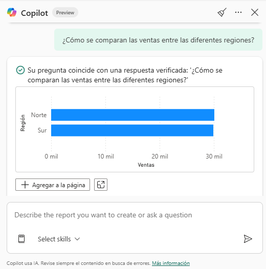

> ***Nota:** Puedes repetir este proceso para otros objetos visuales en el informe, asegurándote de que Copilot tenga respuestas verificadas para diversas consultas relacionadas con los datos.*

---

### Tarea 5. Crear un área de trabajo y Publicar el informe en Power BI Service

1. Guardar el informe en Power BI Desktop.

2. Publicar el informe en Power BI Service seleccionando **Publicar** en la pestaña de **Inicio**.

3. Seleccionar el área de trabajo adecuada que soporte Copilot (Creada anteriormente en la Tarea 1).

    

4. Abrir informe publicado en Power BI Service para verificar que todas las funcionalidades de Copilot estén operativas.

    

5. Dar clic en el botón de **Copilot** para interactuar con el informe publicado y generar preguntas sobre los datos y resumir informes.
    - Ejemplo de mensaje:
    
        > "¿Qué destaca en los datos?

    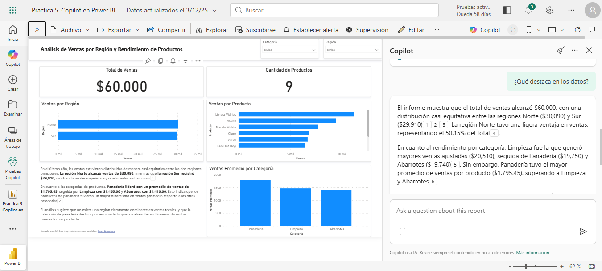

    - Ejemplo de mensaje:
    
        > "Recomendaciones para complementar mi informe de ventas, dame una lista de datos que puedo agregar para mejorar mi análisis."

    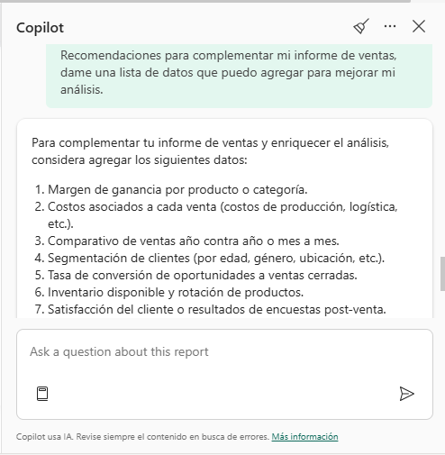

> ***Nota:** Realiza varias consultas para explorar las capacidades de Copilot en el informe publicado.*

---

### Resultado esperado

Al finalizar el laboratorio, el participante tendrá:
- Un informe en Power BI Desktop que utiliza Copilot para generar visualizaciones y narrativas basadas en datos.
- Un informe publicado en Power BI Service con funcionalidades de Copilot activas para interactuar con los datos mediante lenguaje natural.

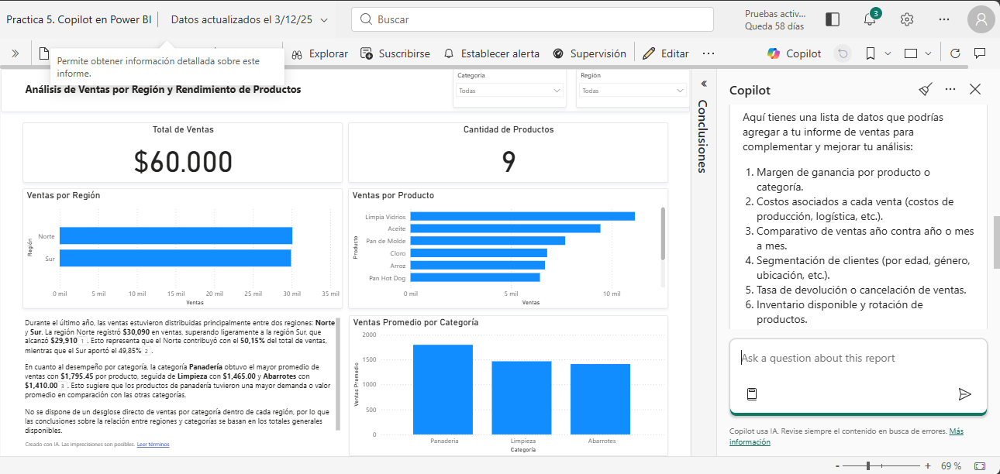
